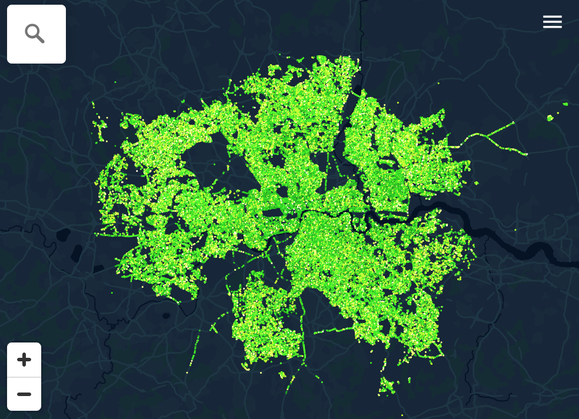

<p align="center">
  <a href="https://apps.london.gov.uk/gitea/gla-intelligence/street-trees">
    
  </a>

  <h3 align="center">LONDON STREET TREES</h3>

  <p align="center">
    mapping local authority and TfL maintained trees
    <br />
    <a href="https://data.london.gov.uk/dataset/local-authority-maintained-trees"><strong>Explore the background »</strong></a>
    <br />
    <br />
    <a href="https://apps.london.gov.uk/street-trees/">View Site</a>
    ·
    <a href="https://apps.london.gov.uk/gitea/gla-intelligence/street-trees/issues">Report Bug</a>
    ·
    <a href="https://apps.london.gov.uk/gitea/gla-intelligence/street-trees/issues">Request Feature</a>
  </p>

## Table of contents

- [About The Project](#about-the-project)
  - [Built With](#built-with)
- [Client side](#client-side)
  - [Prerequisites](#prerequisites)
  - [Installation](#installation)
  - [Usage](#usage)
- [Data](#data)
  - [Tileserver](#tileserver)
- [Exploratory Data Analysis](#exploratory-data-analysis)
  - [Convert to csv](#convert-to-csv)
  - [Convert easting/northing to lng/lat](#convert-eastingnorthing-to-lnglat)
  - [Using Datasette](#using-datasette)
- [Roadmap](#roadmap)
- [Contributing](#contributing)
- [License](#license)
- [Contact](#contact)
- [Acknowledgements](#acknowledgements)

## About The Project

[](https://apps.london.gov.uk/street-trees)

This map showcases the data published by a datastore project to provide open tree data for london. https://data.london.gov.uk/dataset/local-authority-maintained-trees

<blockquote>
This map has been created using tree data made available by London’s local authorities and Transport for London. It shows information for over 800,000 trees. The majority of these are street trees, with some trees in parks and open spaces. London has over 8 million trees, so the map is only a partial illustration of the capital’s urban forest.
</blockquote>

### Built with

- [node](https://nodejs.org/en/)
- [create-react-app](https://create-react-app.dev/)
- [gh-pages](https://github.com/tschaub/gh-pages)
- [material-ui](https://material-ui.com/)
- [react-semantic-ui](https://react.semantic-ui.com/)
- [maplibre-gl-js](https://github.com/maplibre/maplibre-gl-js)
- [observable](https://obervablehq.com)
- [postgis](https://postgis.net/)
- [tippecanoe](https://github.com/mapbox/tippecanoe)
- [tileserver-gl-light](https://www.npmjs.com/package/tileserver-gl-light)
- [dirt](https://github.com/tobinbradley/dirt-simple-postgis-http-api/)
- [datasette](https://datasette.io/)
- [jupyter](https://apps.london.gov.uk/trees/)

## Browser side

To run this project from the frontend, connecting to the GLA api and database, you'll need nodejs for development, testing and building

### Prerequisites

- [nvm](https://github.com/nvm-sh/nvm#installing-and-updating)

  ```sh
  curl -o- https://raw.githubusercontent.com/nvm-sh/nvm/v0.37.2/install.sh | bash
  ```

- node
  ```sh
  nvm install node
  ```

### Installation

1. Clone the repo
   ```sh
   git clone https://apps.london.gov.uk/gitea/gla-intelligence/street-trees.git
   cd street-trees
   ```
2. Install NPM packages
   ```sh
   npm install
   ```

### Usage

#### Local development

##### Create-react-app

`create-react-app` bundles a webserver with live reloading so for development purposes you can run `npm start` then start working on the code and seeing the changes at http://localhost:3000

##### Maplibre

This map uses the community fork of Mapbox V1 - bindings for react were not released on the initial fork, but are on the roadmap

##### Design elements

Form elements used in this project are mainly from the [material-ui](https://material-ui.com/) library and provide keyboard operability and a high level of usability

The design additionally makes use of the [react-semantic-ui](https://react.semantic-ui.com/) placeholder components to show during asynchronous loading

##### Map legend colouring

An [observable notebook](https://observablehq.com/d/fd239fea18f1c574) used to explore the tree palette used in this map

#### Deployment

##### gh-pages (for test deployments)

`package.json` is configured to build and deploy to github-pages by specifying the `homepage` property, either as the full page url, e.g. `https://joelondon.github.io/street-trees` or as a dot

```sh
npm run deploy
```

##### apps.london.gov.uk

To publish on `apps.london.gov.uk` simply commit the development work (i.e. js work in the `src` directory) and push to this repo's remote on that server - the `post-receive` git-hook will build the `public` directory and copy to the web root at `/street-trees`

#### React Tests

`npm test` launches the tests, which will run when the react bindings for `maplibre-gl-js` become available

## Data

The data is a merge of the current data release from GiGL with its predecessor.

The data is stored in Postgis and accessed via a separate tileserver and a data api although the latter can also be used to serve tiles straight from Postgis via [dirt](https://apps.london.gov.uk/gitea/gla-intelligence/dirt-postgres-http-api)

### Tileserver

We use the `tileserver-gl-light` tileserver to provide the `.mbtiles` SQLite database

#### Getting the data from Postgis to .mbtiles via GeoJSON

Using `ogr2ogr` to get GeoJSON out of Postgis for .mbtiles creation via Tippecanoe

```sh
ogr2ogr -t_srs "EPSG:4326" -f GeoJSON -lco COORDINATE_PRECISION=5 trees.geojson \
 "PG:host=**** dbname=**** user=**** password=******" \
 -sql "select borough, gla_tree_group as gla_tree_group, tree_name, cast(load_date as varchar(8)), age, cast(spread_m as numeric(38,2)) as spread_m, cast(height_m as numeric(38,2)) as height_m, cast(diameter_at_breast_height_cm as numeric(38,2)) as diameter_at_breast_height_cm, age_group, objectid, geom FROM core_london_street_trees_web"
```

#### Convert resulting GeoJSON into .mbtiles with Tippecanoe

```sh
for f in trees.geojson; do echo "Processing $f";  tippecanoe  -o $f.mbtiles  --force  --maximum-zoom=20  --minimum-zoom=5  --drop-rate=1  --drop-densest-as-needed --clip-bounding-box=-0.489,51.28,0.236,51.686 $f; done
```

#### Publish the tiles to the tileserver

GLA GIS maintain a separate [repository of tiles](https://apps.london.gov.uk/gitea/gla-intelligence/tileserver.git) that performs continuous deployment on uploaded tilesets/configs - _please note_ that the nginx config requires amending to allow `FileUpload` sizes that accomodate the size of `.mbtiles` being uploaded.

### Postgis HTTP API

We use the [dirt-postgres-http-api](https://apps.london.gov.uk/gitea/gla-intelligence/dirt-postgres-http-api) to enable the statistics queries carried out from the frontend application

Dirt can also be used to serve tiles straight from postgis, removing the need for a tileserver, although storing data in .mbtiles`and serving them with`tileserver-gl-light` offers better performance

#### Total trees in London

[https://maps.london.gov.uk/v1/query/core_london_street_trees_web_3857?columns=count(gla_tree_group)%2Cgla_tree_group&group=gla_tree_group](<https://maps.london.gov.uk/v1/query/core_london_street_trees_web_3857?columns=count(gla_tree_group)%2Cgla_tree_group&group=gla_tree_group>)

#### Tree type counts by borough

[https://maps.london.gov.uk/v1/query/core_london_street_trees_web_3857?columns=count(gla_tree_group)%2Cgla_tree_group%2Cborough&group=borough%2Cgla_tree_group](<https://maps.london.gov.uk/v1/query/core_london_street_trees_web_3857?columns=count(gla_tree_group)%2Cgla_tree_group%2Cborough&group=borough%2Cgla_tree_group>)

#### Total trees per borough

[https://maps.london.gov.uk/v1/query/core_london_street_trees_web_3857?columns=count(borough)%2Cborough&group=borough](<https://maps.london.gov.uk/v1/query/core_london_street_trees_web_3857?columns=count(borough)%2Cborough&group=borough>)

## Exploratory Data Analysis

This dataset is `Point` geometry and easy to explore spatially using Datasette

1. get the [spreadsheet](https://gigl.sharepoint.com/Shared%20Documents/Forms/AllItems.aspx?id=%2FShared%20Documents%2FSLA%20Partners%2FGLA%2FGLA%20Street%20Tree%20Update&p=true&originalPath=aHR0cHM6Ly9naWdsLnNoYXJlcG9pbnQuY29tLzpmOi9nL0Vyamw2V2thbTExUHJSWkZkczFndnlBQnJYTEN2TXI2V2NKVG9DaG9wQXR1Ymc_cnRpbWU9RDBGXzNsTnMyRWc) maintained by GiGL
2. convert to csv
3. convert easting/northing to lng/lat (optional)
4. load in Datasette

### Convert to csv

Open in your spreadsheet software and save as csv

### Convert easting/northing to lng/lat

_NOTE - IF Lng/Lat are available then this step can be skipped, but it is useful to show the use of a geocoder via notebooks_

use [this notebook](https://observablehq.com/d/ecaa07729ae5b57a) making use of os-places api and proj4js, which uses [os-places api](https://apidocs.os.uk/docs/os-places-endpoints) to geocode postcodes using addressbase _A search based on a properties postcode. The minimum for the resource is the area and district e.g. SO16, and will accept a full postcode consisting of the area, district, sector and unit e.g. SO16 0AS ._

### Using Datasette

Assuming it has Lng/Lat values, a CSV can be converted into a SQLite database for screening and then previewed and explored with help from plugins, including a leafet point cluster map which is useful for data screening at the start of a project:

```sh
csvs-to-sqlite Borough_tree_list_2021 street-trees.db`
datasette street-trees.db
```

Once Datasette is running, you can browse the database on http://127.0.0.1:8001

There is a demo version at https://apps.london.gov.uk/Borough_tree_list_2021

### Using Jupyter Notebooks

In addition to using Datasette for screening point data, we also have a notebook for exploring the data for patterns that can be highlighted in the map design - it uses `geopandas` and `folium` for plotting - very useful for outlier detection

```sh
cd notebook
pyenv install miniconda3-latest
pyenv local miniconda3-latest
jupyter-notebook
```

## Roadmap

See the [issues](https://apps.london.gov.uk/gitea/gla-intelligence/street-trees/issues) for a list of proposed features and known issues

## Contributing

Pull requests can be made as follows:

1. Fork the Project
2. Create your Feature Branch (`git checkout -b feature/AmazingFeature`)
3. Commit your Changes (`git commit -m 'Add some AmazingFeature'`)
4. Push to the Branch (`git push origin feature/AmazingFeature`)
5. Open a Pull Request

## License

Distributed under the GPLV3 License. See `LICENSE` for more information

## Contact

Joe Leach - joseph.leach@london.gov.uk

Project Link: [https://apps.london.gov.uk/gitea/gla-intelligence/street-trees](https://apps.london.gov.uk/gitea/gla-intelligence/street-trees)

## Acknowledgements

- [https://www.gigl.org.uk/street-trees/](https://www.gigl.org.uk/street-trees/)
- [https://www.treetalk.co.uk/](https://www.treetalk.co.uk/)
- [https://opentrees.org/](https://opentrees.org/#pos=1/-37.8/145)
- [https://wiki.openstreetmap.org/wiki/City_tree_registers](https://wiki.openstreetmap.org/wiki/City_tree_registers)
